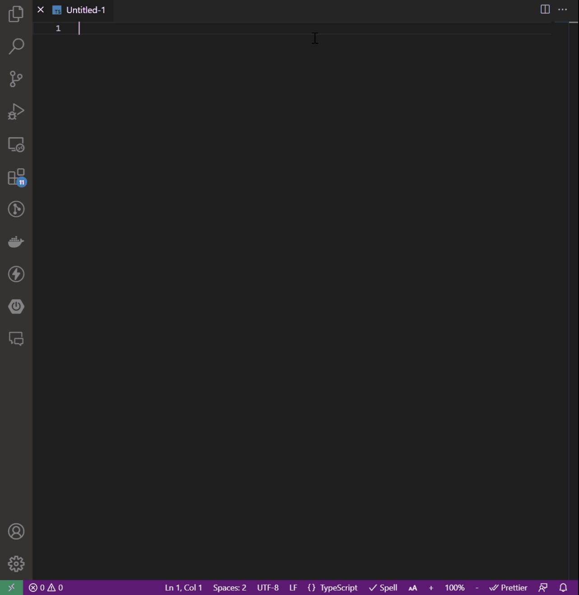

# my-test-extension README

VSCodeの拡張機能開発の実験。

OpenAIに依頼して、記載している要件でソースコードを生成したり、リファクタリングしたりする。

- `MyTestExtension: Register OpenAI API Key`
  → OpenAI の API キーを VSCode の SecretStorage に登録する。
- `MyTestExtension: Unregister OpenAI API Key`
  → SecretStorage に登録済みの OpenAI の API キーを削除する。
- `MyTestExtension: Generate code`
  → 選択行もしくは現在行に記載の要件でソースコードを生成する。
- `MyTestExtension: Refactor code`
  → 選択行もしくは現在行に記載のソースコードをリファクタリングする。
